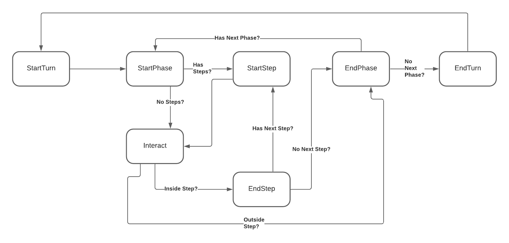

# RuleKeeper
RuleKeeper is an event based module that allows the development of advanced turn-based games in javascript.

## Installation
Use the `npm` or `yarn` to install it
```bash
npm i rulekeeper
# or
yarn add rulekeeper
```

## Usage
Here is an example of how you could use the module

```javascript
import { RuleKeeper } from 'rulekeeper'

RuleKeeper({
  player: {
    setup: {
      name: '...',
      life: 20,
      ...
    }
  },
  game: {
    maxPlayers: 2,
    timeLimit: false,
    state: {
      numberOfCards: 100,
      ...
    },
    endIf: (state, ctx) => {
      const { life } = ctx.currentPlayer.getProps()
      return life <= 0
    }
  },
  turn: {
    onStart: (state, ctx) => {},
    onEnd: (state, ctx) => {}
  },
  phases: {
    drawPhase: {
      steps: [{
        name:  'Step1'
      }, {
        name: 'Step2'
      }],
      onStart: (state, ctx) => {},
      onEnd: (state, ctx) => {},
      nextPhase: 'mainPhase'
    },
    mainPhase: {
      ...
    },
    ...
  }
})
// .....
```

## How it works?
RuleKeeper follows a specific life cycle. You can hook functions to observe specific events to reflect into the game.



## Contributing
**The contributing is not available in this project (yet)**. Since this is still a draft, there's not much to contribute. When this project become something more tangible, I'll add a CONTRIBUTING.md with the guidelines and rules to contribute.

If you are interested in contribute to this project while its still in draft phase, let me know! I will appreciate any kind of help :D 

<!-- Pull Requests are most welcome, of any sorts. If you wish to contribute, please take a look at our CONTRIBUTING.md for some general guidelines. -->
 
## License
[MIT](https://choosealicense.com/licenses/mit/)